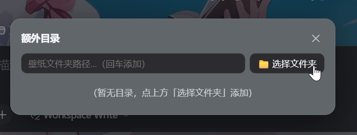
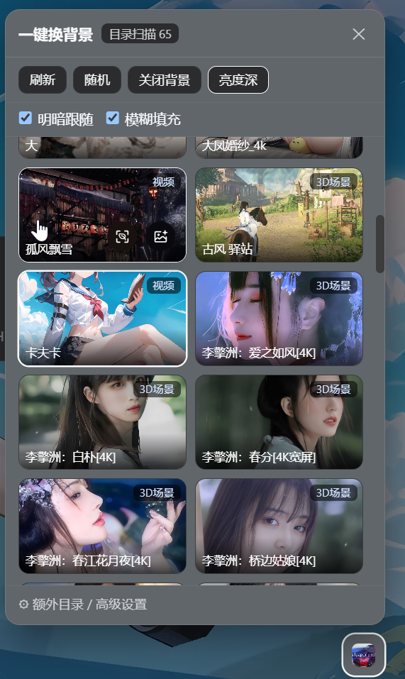
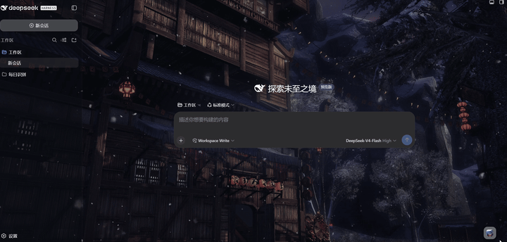

# dsh-wallpaper-engine

DSH Web GUI 的一键换背景插件：从本机 Wallpaper Engine 素材库（图片 / 视频，目前只支持这2种）里选一张，一键应用到 DSH 界面背景，并可联动切换 DSH 深/浅色主题。

## 功能

- **壁纸库**：侧边栏底部按钮打开选择面板（缩略图网格 + 搜索）。
- **两种素材来源**（`/we/list?source=auto` 自动选择）：
  1. **Wallpaper Engine Web API**：WE 自带的本地 Web 服务（默认 `http://localhost:26384/api/wallpaper/list`），仅在 WE 运行且其本地 Web 服务可用时生效；未启用/不可用时自动回退目录扫描；
  2. **目录扫描（回退）**：自动发现所有 Steam 库（读取注册表 + `libraryfolders.vdf`），扫描 `steamapps/workshop/content/431960/*`（创意工坊）和 `steamapps/common/wallpaper_engine/projects/myprojects/*`（本地项目），解析 `project.json`。
- **一键应用**：图片 → CSS 背景；视频 → 静音循环 `<video>`；3D 场景 / 网页壁纸 → 用其 `preview.jpg` 静态展示。应用后 App 框架与侧边栏变为半透明 + 毛玻璃（`backdrop-filter`），壁纸透出。
- **明暗跟随**：勾选后按壁纸亮度自动切换 DSH 深色 / 浅色主题（`theme.setTheme`）。
- **持久化**：当前壁纸与设置存 `localStorage`，刷新不丢；额外目录等配置存 `$DSH_HOME/storages/dsh-wallpaper-engine.json`。
- **随机 / 关闭背景**：一键随机换，或一键恢复 DSH 默认背景。

### 功能展示







## 安装（以 web profile 为例）

### 从 npm 安装（推荐）

```powershell
dsh plugin --profile web add @marlonlau/dsh-wallpaper-engine
```

该命令会写入依赖，并自动把包追加进 `dsh.profile.bundles`；随后重启 `dsh web` 生效（客户端改动刷新页面即可）。

### 从 GitHub 仓库安装（开发调试）

插件包已在 npm 发布，仓库安装仅供开发调试（需要 Node.js >= 18 与 git）：

```powershell
# 1. 克隆仓库
git clone https://github.com/marlonLau/dsh-wallpaper-engine.git
cd dsh-wallpaper-engine

# 2. 把插件包链接进 web profile（本插件为单包、零依赖、无构建步骤）
dsh plugin --profile web add "link:$PWD"

# 3. 重启 dsh web
dsh web
```

> 等价手动方式：在 profile 的 `package.json` 里加依赖
> `"@marlonlau/dsh-wallpaper-engine": "link:<仓库绝对路径>"`，并把它追加进 `dsh.profile.bundles`，然后 `pnpm install`。

## 宿主路由

| 路由 | 说明 |
|---|---|
| `GET /we/list` | 壁纸列表（`source=auto\|api\|scan`，`refresh=1` 强制重扫） |
| `GET /we/status` | API 可用性 / 根目录 / 数量诊断 |
| `GET /we/file?p=…` | 媒体文件（图片/视频，支持 HTTP Range） |
| `GET /we/preview?p=…` | 预览缩略图 |
| `GET/POST /we/config` | 配置（额外目录、API 地址、API 开关） |

所有路由有回环/内网信任围栏；文件路由只允许壁纸项目目录内的媒体扩展名。

## 开发

- 宿主半区：`lib/index.js`（Node，`inject: ['webServer']`）
- 客户端半区：`lib/client.js`（浏览器，`inject: ['theme', 'workspaces']`，手写 CJS bundle，`window.__ModuleLoader__.load(...)`）
- 改 `lib/client.js` 后刷新页面即可生效；改 `lib/index.js` 需重启 `dsh web`。

## 仓库

- 源码：<https://github.com/marlonLau/dsh-wallpaper-engine>
- npm：<https://www.npmjs.com/package/@marlonlau/dsh-wallpaper-engine>

## 后续可做

- 通过 WE API `POST /api/wallpaper/set` 联动设置 Windows 桌面壁纸
- 定时轮换 / 播放列表
- 毛玻璃强度、暗化程度可调
